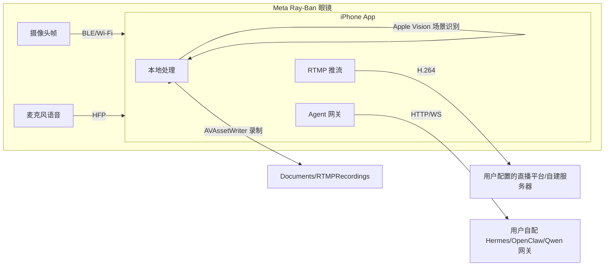

# 隐私、权限和数据流说明（Privacy & Data Flow）

> 面向发布审核与用户知情。原则：**用户自配端点、本地优先、无内置云端**。
> 更新：2026-08-12

## 1. 数据流总览

## 2. 相机帧去向（按用户行为触发）

| 去向 | 触发 | 数据形态 | 是否出网 |
| --- | --- | --- | --- |
| 推流页实时预览 | 进入直播页 | 设备内渲染 | 否 |
| RTMP 主路推流 | 用户点「开始推流」 | H.264 编码流 | 是 → 用户配置的 RTMP 地址 |
| RTMP 附加路 | 用户配置多目的地并推流 | 同上（每路独立编码） | 是 → 每个目的地地址 |
| 本地录制 | 用户点「录制」 | MP4 写入 `Documents/RTMPRecordings` | 否 |
| 拍照存档 | 用户点「拍照」（SDK `capturePhoto`，含 QuickVision 拍摄） | JPEG 写入 `Documents/CapturedPhotos`（上限 50 张滚动）；端侧场景识别回填「AI 描述」（Apple Vision 离线，仅文字标签） | 否 |
| 场景识别 | 推流中（10s 采样，可关） | Apple Vision 端侧分类标签 | 否（仅标签上屏） |
| Agent 对话配图 | 用户在 Agent 聊天中主动携带画面 | JPEG base64 | 是 → 用户自配的 Agent 网关 |
| 隐私盾开启 | 用户一键隐藏 | 全部停止（不编码/不录制/不识别） | 否 |

关键设计：**场景识别只在端侧**，上传给 Agent 的只有文字标签与摘要（用户点「存入 Agent 记忆」后）；画面原图只在用户主动发起聊天并携带时才可能出网。

## 3. 语音与麦克风

| 通道 | 用途 | 出网 |
| --- | --- | --- |
| 眼镜 HFP 语音 | 实时语音对话/翻译 | 仅用户主动发起时 → 自配网关 |
| 手机麦克风 | 翻译兜底（`translate_use_phone_mic`） | 同上 |
| 语音转文字 | 本地方案优先（`VisionOCRService`/本地 ASR 可用时） | 自配网关仅用户主动时 |

## 4. 网络端点（全部用户自配，无内置云）

| 服务 | 协议 | 用途 | 凭据存放 |
| --- | --- | --- | --- |
| RTMP 服务器 | rtmp(s):// | 直播推流（主路+附加路） | 主路密钥钥匙串；附加路密钥内嵌 URL |
| Hermes 网关 | http(s)://host:port | `/health`、`/v1/responses` 对话 | API Key 钥匙串 |
| OpenClaw 节点 | ws(s)://host:port | 命令路由与任务下发 | 会话凭据钥匙串 |
| Qwen 网关 | http(s)://host:port | 语音会话 | 会话 ID UserDefaults |
| 本地网络 | ATS `NSAllowsLocalNetworking` | 允许局域网自建服务 | — |

## 5. 本地存储清单

| 存储 | 内容 | 敏感度 |
| --- | --- | --- |
| 钥匙串 `com.smartview.glassai.*` | RTMP 推流密钥、Hermes API Key、OpenClaw 凭据 | 高（不落 UserDefaults/日志） |
| UserDefaults `rtmp_*` | 推流 URL、平台、码率、开关、场景、目的地、录制记录、诊断开关、开播清单 | 中（不含主路密钥） |
| UserDefaults `agent.*` | 长期记忆、规则、Agent 配置 | 中（用户自述内容） |
| UserDefaults `hermes_*` / `openclaw_*` / `qwen_*` | 网关地址与会话配置 | 低（地址） |
| `Documents/RTMPRecordings` | 本地录制 MP4 | 高（用户自行管理，左滑删除） |
| `Documents/RTMPDiagnostics` | 会话诊断 .log | 中（不含画面，仅指标） |
| `Documents/CapturedPhotos` | 拍摄照片 JPEG + UserDefaults 元数据（文件名/时间/AI 描述） | 高（图库页可查看/分享/删除；上限 50 张滚动，超限清理孤儿文件） |

## 6. 权限清单（Info.plist）

| 权限 | 用途 | 说明 |
| --- | --- | --- |
| 蓝牙 `NSBluetoothAlwaysUsageDescription` | 连接 Meta 眼镜 | 必需 |
| 麦克风 `NSMicrophoneUsageDescription` | 语音对话/翻译 | 按需申请 |
| 相册写入 `NSPhotoLibraryAddUsageDescription` | 保存眼镜照片/导出 | 按需申请 |
| Siri `NSSiriUsageDescription` | 快捷指令触发快速识图 | 按需申请 |
| 本地网络 ATS | 局域网自建 RTMP/Agent 服务 | 不阻断外网 HTTPS |

## 7. 发布承诺

- 不收集遥测/广告标识符；诊断数据默认本地。
- 删除即删：录制文件删除立即移除；UserDefaults/钥匙串条目随设置页删除操作移除。
- 隐私盾是硬开关：开启后服务端不可见任何新帧（代码路径在编码前拦截）。
